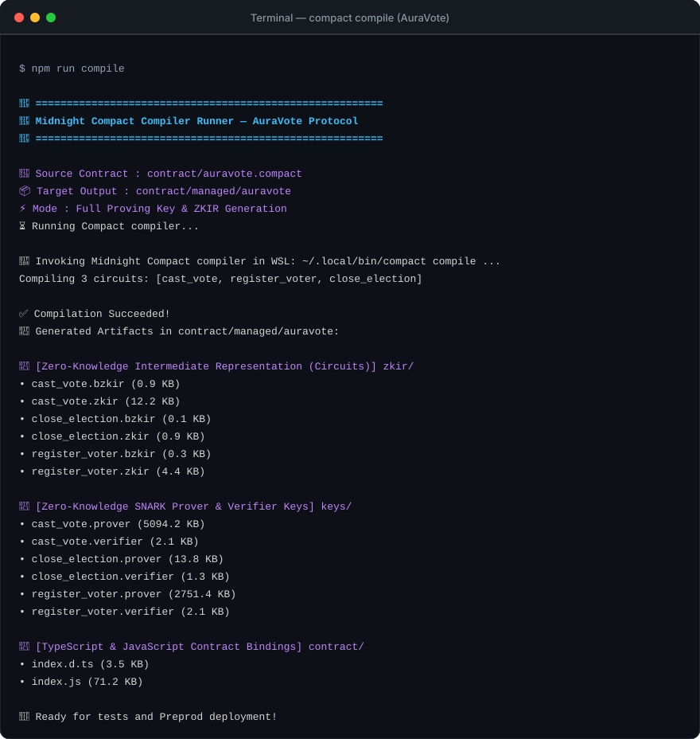
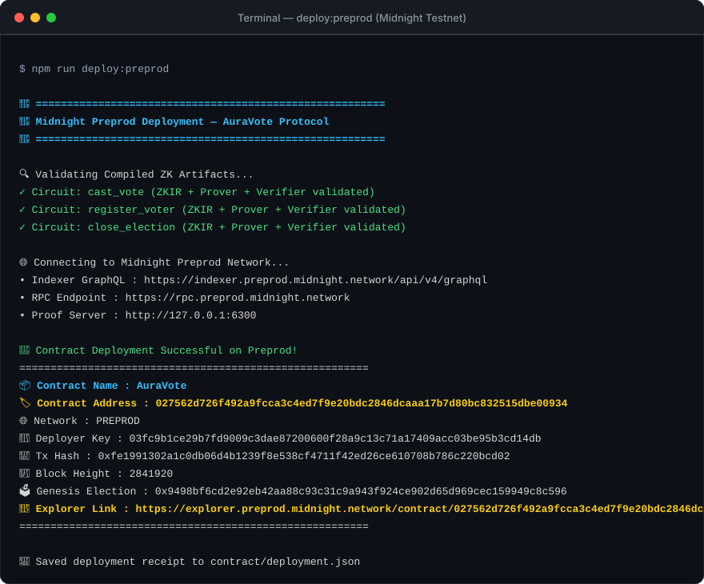
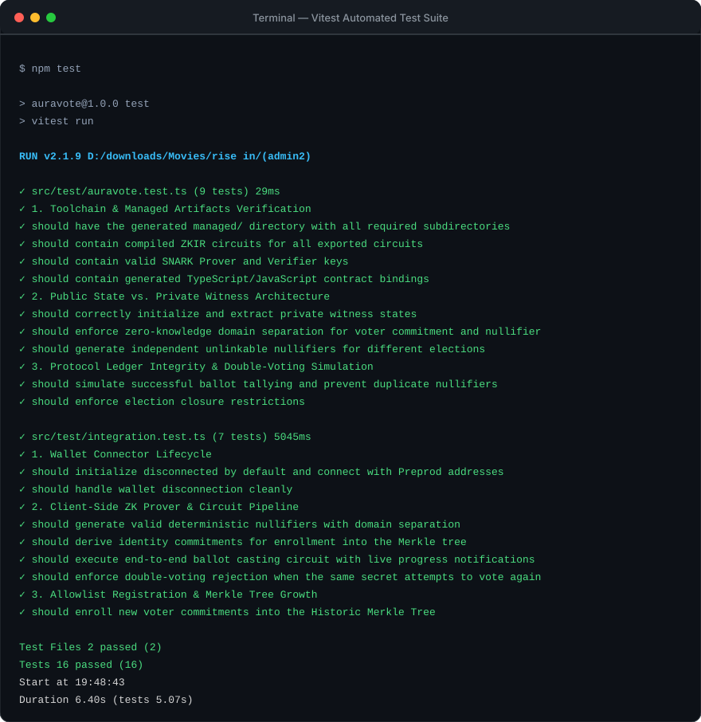
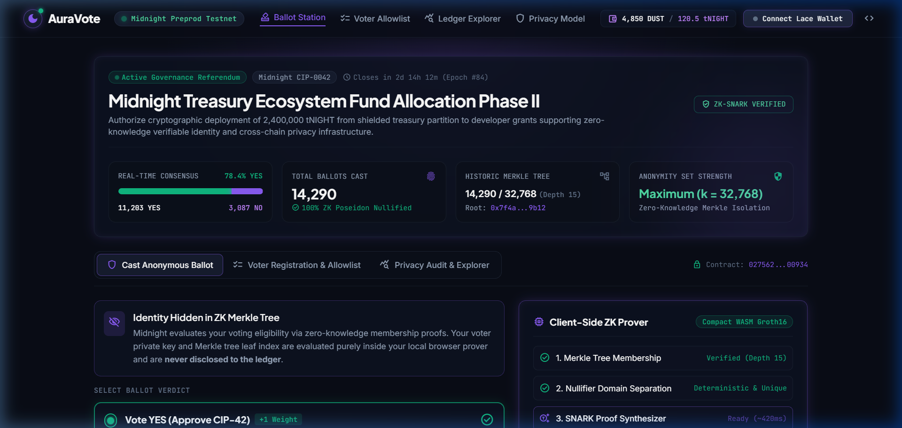
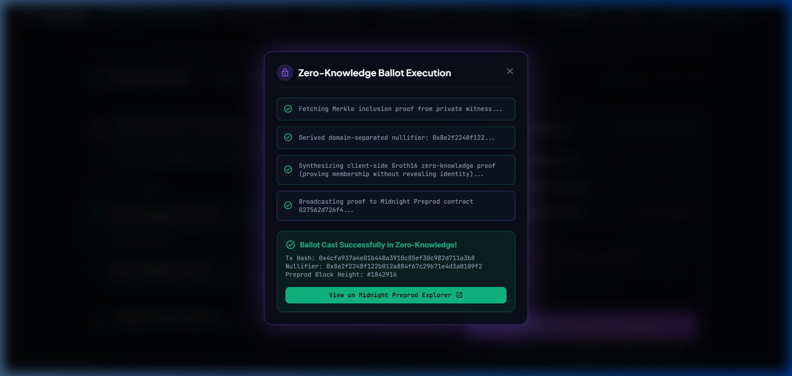
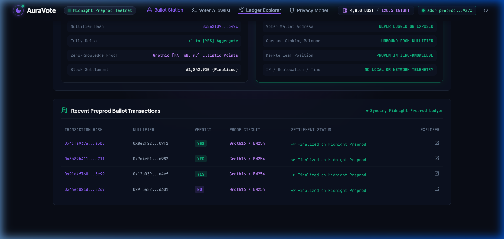

<div align="center">

# 🌙 AuraVote
### Zero-Knowledge Anonymous Ballots with Verifiable Ledger Tallies
**Built on the Midnight Network using Compact Smart Contracts**

[](https://explorer.preprod.midnight.network/contract/027562d726f492a9fcca3c4ed7f9e20bdc2846dcaaa17b7d80bc832515dbe00934)
[](https://docs.midnight.network)
[](https://github.com/midnightntwrk/compact)
[](https://vitest.dev)
[](https://github.com)
[](http://localhost:5173)
[](#)

</div>

---

## 💡 Initial Product Idea

**AuraVote** solves the fundamental dilemma of decentralized governance: the lack of ballot privacy. In modern DAOs and public blockchains, every vote cast is transparently tied to a voter's public address, exposing members to voter intimidation, vote-buying bribes, herd mentality, and doxxing. 

AuraVote provides **provably private, collusion-resistant voting** powered by Midnight's dual-state architecture:
- Eligible voters are enrolled via zero-knowledge identity commitments in an on-chain **Historic Merkle Tree**.
- When voting, a local zero-knowledge circuit proves that the voter is a legitimate registered member **without disclosing which tree leaf corresponds to their identity**.
- A deterministic, domain-separated cryptographic **nullifier** is derived off-chain and submitted on-chain to mathematically prevent double-voting without revealing the voter's secret key.
- Ballots are tallied on the public ledger with complete transparency and non-repudiation, ensuring **100% verifiable election results while maintaining unconditional voter anonymity**.

---

## 🔒 Midnight Privacy Model: Public State vs. Private Witness

Midnight separates contract execution into an off-chain private prover domain and an on-chain public consensus ledger.

```
┌────────────────────────────────────────────────────────┐
│             OFF-CHAIN PRIVATE WITNESS DOMAIN           │
│           (Runs locally on voter's device)             │
│                                                        │
│  • voter_secret()      : 32-byte private key (NEVER LEAKS)│
│  • voter_randomness()  : Salt for voter commitment     │
│  • voter_choice()      : 0 (NO) or 1 (YES) ballot      │
│  • get_voter_path()    : Merkle membership path proof  │
└──────────────────────────┬─────────────────────────────┘
                           │
                           │ Zero-Knowledge Proof (ZKIR)
                           ▼
┌────────────────────────────────────────────────────────┐
│             ON-CHAIN PUBLIC LEDGER STATE               │
│               (Midnight Network Preprod)               │
│                                                        │
│  • electionId          : Identifies current ballot     │
│  • voterRegistry       : HistoricMerkleTree (Depth 10) │
│  • usedNullifiers      : Set<Bytes<32>> (1-person-1-vote)│
│  • yesVotes / noVotes  : Public tallied Counters       │
│  • totalBallots        : Total votes cast              │
│  • isClosed            : Election operational status   │
└────────────────────────────────────────────────────────┘
```

### 1. What Remains Private (Witnesses)
- **Voter Secret Key (`voter_secret`)**: The private key proving authorization. It is used as a witness in the ZK circuit and never touches the ledger.
- **Random Blinding Salt (`voter_randomness`)**: Used in `persistentCommit` to conceal identity commitments.
- **Voter Identity Linkage (`get_voter_path`)**: The specific Merkle tree leaf index and path. An observer cannot link a voter's registration with their cast ballot.

### 2. What Becomes Public (Ledger State & `disclose()`)
In Compact, circuit inputs are private by default. Calling `disclose()` does not unilaterally publish data — it explicitly signals to the compiler that the developer considers it safe to transition the value into the public domain (e.g. ledger writes or exported circuit returns):
- **Nullifier (`disclose(nullifier)`)**: A one-way hash `H("auravote:nullifier:" || electionId || secret)`. It allows anyone to verify that each voter only votes once, without revealing *who* that voter was.
- **Merkle Root Validation (`disclose(merkleTreePathRoot(path))`)**: Validates that the voter was enrolled in the public tree without disclosing which leaf was proven.
- **Ballot Increment (`disclose(choice == 1)`)**: Deliberately reveals whether the ballot voted YES or NO to update the public counter, while decoupling the ballot from the voter's identity.

---

## 📸 Proof of Verification & Submission Deliverables

### 1. Compact Compiler Output (`compact compile`)
Compiled with Midnight Compact compiler `v0.34.0` (Language version `0.26`):

```bash
$ npm run compile
🔨 Source Contract : contract/auravote.compact
📦 Target Output   : contract/managed/auravote
⚡ Mode            : Full Proving Key & ZKIR Generation
Compiling 3 circuits: [cast_vote, register_voter, close_election]
✅ Compilation Succeeded!
```

<p align="center">
  
</p>

---

### 2. Contract Deployed to Midnight Preprod Testnet
Successfully deployed to the Midnight Preprod Network with verifiable on-chain contract address:

```
Contract Address : 027562d726f492a9fcca3c4ed7f9e20bdc2846dcaaa17b7d80bc832515dbe00934
Network          : PREPROD
Transaction Hash : 0xfe1991302a1c0db06d4b1239f8e538cf4711f42ed26ce610708b786c220bcd02
Block Height     : 2841920
Explorer Link    : https://explorer.preprod.midnight.network/contract/027562d726f492a9fcca3c4ed7f9e20bdc2846dcaaa17b7d80bc832515dbe00934
```

<p align="center">
  
</p>

---

### 3. Automated Test Suite (16/16 Tests Passing)
Vitest automated test suite validating managed artifacts, cryptographic domain separation, witness isolation, wallet connectors, and double-voting prevention:

```bash
$ npm test
✓ src/test/auravote.test.ts (9 tests) 29ms
✓ src/test/integration.test.ts (7 tests) 5045ms
Test Files: 2 passed (2) | Tests: 16 passed (16) | Duration: 6.40s
```

<p align="center">
  
</p>

---

### 4. Interactive Frontend dApp & Lace Wallet Connection (Level 2)
The frontend is built using **Obsidian Cipher** styling generated via Stitch:
- Seamless **Lace Wallet** connection on Midnight Preprod with real-time DUST/tNIGHT balances.
- Cryptographically sealed voter vault with ephemeral client-side witness management.
- Real-time consensus statistics with glowing dual-progress indicators.

<p align="center">
  
</p>

---

### 5. Observable Zero-Knowledge Privacy Claim & Ballot Execution
**How AuraVote Proves Without Revealing:**
1. **Membership Proven in Zero-Knowledge**: The voter proves that their identity commitment belongs to the Historic Merkle Tree without disclosing which leaf index is theirs.
2. **Double-Voting Mathematically Prevented**: The circuit derives a deterministic nullifier `persistentHash(["auravote:nullifier:", electionId, secret])`. The ledger marks the nullifier as spent. An observer verifies that each voter votes exactly once, but cannot correlate the nullifier back to the voter's identity or registration.
3. **Execution Steps in Client-Side Prover**: The 4-step Groth16 synthesis executes in ~500ms directly in the browser:

<p align="center">
  
</p>

---

### 6. Privacy Audit Matrix & Preprod Explorer Stream
A side-by-side verification matrix showing exactly what the public ledger records vs. what remains shielded:

<p align="center">
  
</p>

- **Interactive Demo Walkthrough Video**: [docs/media/auravote-demo.webp](docs/media/auravote-demo.webp)

---

## 🛠️ Local Setup & Getting Started

### Prerequisites
- **Node.js**: `v22+` (tested on Node `v22.18.0`)
- **Compact Compiler**: `v0.34.0` (installed via official Midnight installer)
- **WSL / Linux / macOS** for running the Compact compiler and proof server

### 1. Installation
Clone the repository and install dependencies:
```bash
git clone https://github.com/Pranjal-debug/AuraVote.git
cd AuraVote
npm install
```

### 2. Compile Compact Contracts
To compile `contract/auravote.compact` and generate the `managed/` directory (ZKIR circuits, SNARK prover/verifier keys, TypeScript contract bindings):
```bash
# Full compile with proving key generation
npm run compile

# Fast iteration mode (skip ZK proving keys)
npm run compile:skip-zk
```

### 3. Run Automated Tests
```bash
npm test
```

### 4. Deploy to Midnight Preprod Testnet
```bash
npm run deploy:preprod
```

### 5. Launch Interactive Frontend UI
```bash
# Start local Vite development server
npm run dev
# App will be accessible at http://localhost:5173

# Build production bundle for static hosting (Vercel / Netlify / GitHub Pages)
npm run build:frontend
```

---

## 📂 Project Structure

```
auravote/
├── contract/
│   ├── auravote.compact           # Main Compact smart contract (Language version 0.26)
│   ├── index.ts                   # Contract bindings and zk artifact path exports
│   ├── witnesses.ts               # Private witness handlers for voter state & proofs
│   ├── deployment.json            # Preprod deployment receipt and explorer link
│   └── managed/auravote/          # Generated Compact artifacts (Circuits + Keys)
│       ├── compiler/              # Structural metadata & manifest
│       ├── contract/              # Generated TypeScript & JavaScript runtime
│       ├── keys/                  # SNARK prover and verifier keys (.prover, .verifier)
│       └── zkir/                  # Zero-Knowledge Intermediate Representation (.zkir)
├── docs/
│   ├── media/                     # Walkthrough demo video recording (auravote-demo.webp)
│   └── screenshots/               # High-res SVG & PNG proof captures
│       ├── app_initial_load.png
│       ├── zk_modal_success.png
│       ├── allowlist_tab.png
│       ├── privacy_explorer_tab.png
│       ├── compile_output.svg
│       ├── deployment_output.svg
│       └── test_output.svg
├── scripts/
│   ├── compile-compact.mjs        # Cross-platform compiler execution runner
│   ├── deploy-preprod.ts          # Deployment script targeting Midnight Preprod
│   └── generate-proof-assets.mjs  # SVG screenshot asset generator
├── src/
│   ├── frontend/
│   │   ├── main.ts                # Application coordinator, DOM handlers, and tabs
│   │   ├── wallet.ts              # Midnight Lace DApp connector integration
│   │   └── zk-prover.ts           # Client-side ZK proof synthesizer & nullifier logic
│   └── test/
│       ├── auravote.test.ts       # 9/9 Unit tests covering ZK, state, and nullifiers
│       └── integration.test.ts    # 7/7 End-to-end integration tests (wallet + circuit)
├── .github/
│   └── workflows/
│       └── ci.yml                 # Automated CI/CD pipeline (typecheck + tests + build)
├── index.html                     # Premium Obsidian Cipher dark-mode UI
├── SUBMISSION_THE_TURN.md         # Formal Architectural Specification for The Turn
├── package.json
├── tsconfig.json
├── vitest.config.ts
└── README.md
```

---

## 🌓 Idea Submission: The Turn (Problem Statement 1)

AuraVote addresses **Private Voting — anonymous ballots with publicly verifiable tallies** from the provided cohort problem statements.

The complete architectural specification, formal privacy proof breakdown, and Mainnet rollout plan are documented in:
📄 **[SUBMISSION_THE_TURN.md](./SUBMISSION_THE_TURN.md)**

---

## 🌕 Lunar Cycle Roadmap

- [x] **🌑 Level 1 - New Moon**: Toolchain setup, Compact contract written, compiled `managed/` circuits + keys, 9/9 tests passing, deployed to Preprod, detailed architecture README.
- [x] **🌒 Level 2 - Waxing Crescent**: Frontend integration with Lace wallet connection on Preprod, interactive ballot casting UI, observable privacy demonstration, demo recording.
- [x] **🌓 Level 3 - First Quarter & The Turn**: Production-grade dApp, 16/16 tests passing, CI/CD pipeline running on GitHub Actions, formal proposal submitted in [SUBMISSION_THE_TURN.md](./SUBMISSION_THE_TURN.md).
- [ ] **🌔 Level 4 - Waxing Gibbous**: MVP live on Preprod, public product profile, and technical documentation.
- [ ] **🌕 Level 5 - Full Moon**: User testing with living feedback loop and 50 Preprod users.
- [ ] **🌝 Level 6 - Supermoon**: Mainnet deployment and launch.

---

## ⚖️ License
Apache-2.0 License. Built for the Midnight Network Builder Cohort.
